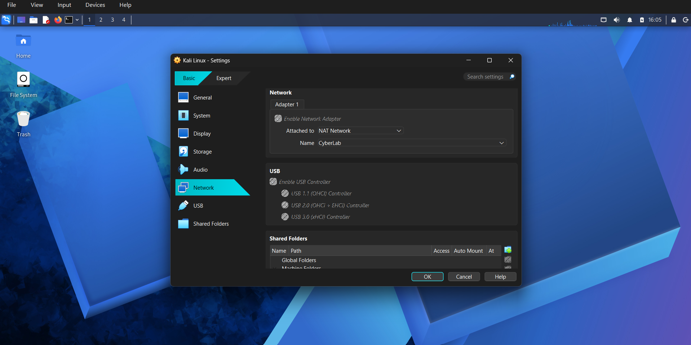
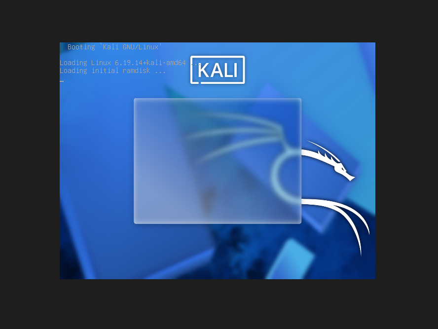
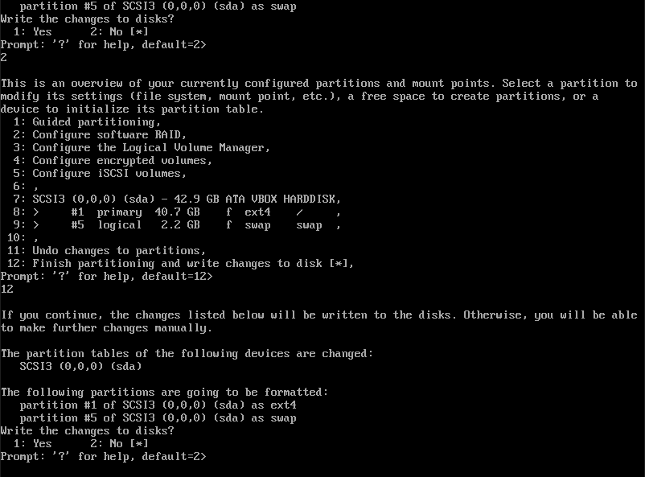
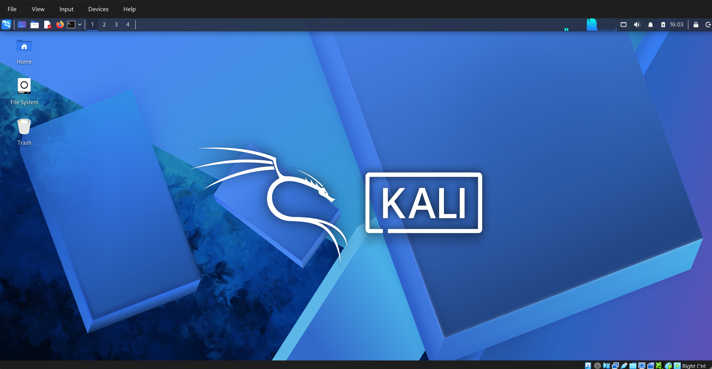
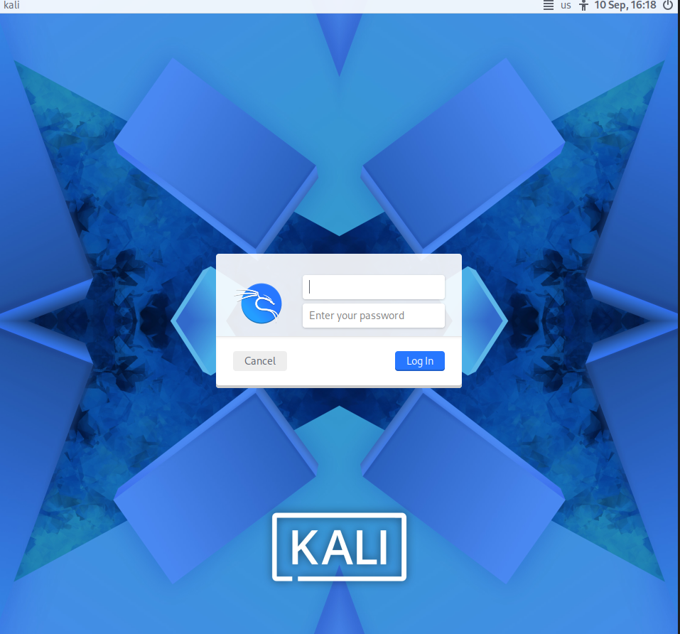
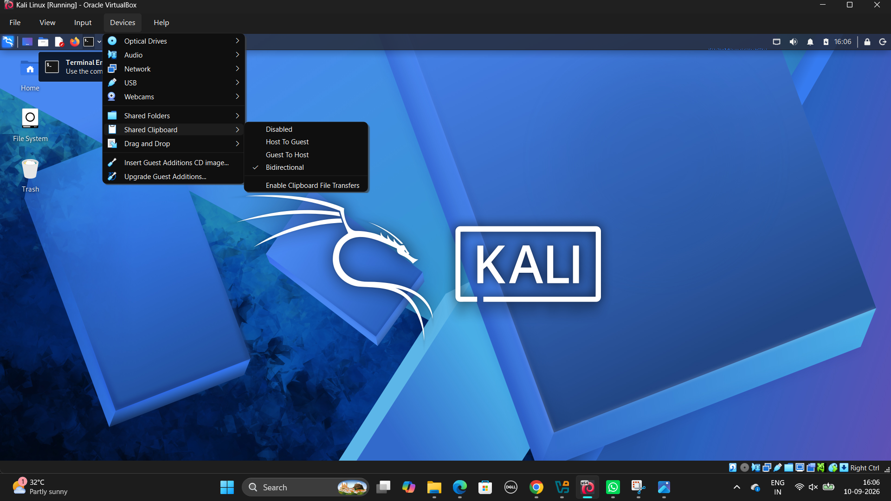

# 🔐 Cybersecurity Virtual Lab — Kali Linux Deployment & Configuration

**A controlled, isolated environment built for security monitoring, detection engineering, and incident-response practice**

---


---

## 📌 Project Overview

This project documents the build-out of an **isolated cybersecurity virtual lab**, using Oracle VirtualBox and Kali Linux as the foundation. The lab is designed to support a security-operations style workflow — log and traffic visibility, detection logic, vulnerability triage, and incident response — rather than just running one-off tools.

The environment sits on its own dedicated NAT network so future systems (a Windows target, an intentionally vulnerable machine) can be dropped in and monitored without ever touching the host network.

Every configuration step in this document has been carried out and verified directly on the VM, including working through real environment issues along the way (kernel/headers mismatch, Guest Additions mount path, service reload conflicts) — see [Problems Encountered & Solutions](#-problems-encountered--solutions) for the full log.

---

## 🎯 Objectives

- Deploy and harden a Kali Linux VM on Oracle VirtualBox
- Build a dedicated, isolated NAT network (`CyberLab`) for the lab
- Assign and verify a static IP for reliable, repeatable testing
- Confirm Internet and DNS connectivity independently
- Configure shared folders, clipboard, and drag-and-drop for evidence handling
- Install and verify VirtualBox Guest Additions
- Prepare the network for future target machines (Windows VM, Metasploitable)
- Document every step, including real issues hit and how they were resolved

---

## 🛡️ Purpose of the Lab

This lab is built to support hands-on practice across the detection and response lifecycle, not just offensive tooling:

- Network reconnaissance & traffic analysis
- Vulnerability assessment
- Web application security testing
- Authentication-log analysis
- SIEM investigation & alert triage
- Digital forensics
- Detection engineering & MITRE ATT&CK mapping
- Incident response

> ⚠️ **Important:** This lab is used strictly against systems inside the isolated `CyberLab` network or systems for which explicit authorization has been obtained. It is never used against production systems or third-party infrastructure.

---

## 🏗️ Lab Architecture

```
                         INTERNET
                            |
                    +-------+-------+
                    |   VirtualBox  |
                    |   NAT Network |
                    |    CyberLab   |
                    |  10.0.0.0/24  |
                    +-------+-------+
                            |
                    +-------+-------+
                    |   Kali Linux  |
                    | Security VM   |
                    |  10.0.0.2/24  |
                    +---------------+
```

**Planned expansion**

```
CyberLab — 10.0.0.0/24
        |
        +---- Kali Linux       10.0.0.2   Security testing / monitoring
        |
        +---- Windows VM       10.0.0.x   Future target
        |
        +---- Metasploitable   10.0.0.x   Future vulnerable target
```

---

## ⚙️ Lab Configuration

| 🧩 Component         | ⚙️ Configuration              |
|-----------------------|--------------------------------|
| 🧰 Hypervisor         | Oracle VirtualBox              |
| 🐉 Guest OS           | Kali Linux (Debian 64-bit)     |
| 🧠 RAM                | 4096 MB                        |
| ⚡ CPU                | 2 vCPUs                        |
| 💾 Virtual Disk       | 40 GB (VDI) — 40.7 GB ext4 `/` + 2.2 GB swap |
| 🖥️ Graphics Controller | VMSVGA                        |
| 🌐 Network Adapter    | Intel PRO/1000 MT Desktop      |
| 📡 Network Mode       | NAT Network — `CyberLab`       |
| 🔢 Network CIDR       | 10.0.0.0/24                    |
| 🐧 Kali IP            | 10.0.0.2/24 (static, via NetworkManager) |
| 🚪 Gateway            | 10.0.0.1                       |
| 🌍 DNS                | 1.1.1.1                        |
| 📂 Shared Folder      | `sf_C_SHORT_QUESTIONS`         |
| 🧩 Guest Additions    | 7.2.4r170995 — installed & verified |

---

## 🪜 Setup Procedure

### Step 1 — Create the NAT Network

A dedicated VirtualBox NAT Network, `CyberLab`, was created on `10.0.0.0/24` with `10.0.0.1` as the gateway. Keeping the lab on its own NAT network isolates all lab traffic from the host's regular network while still allowing outbound Internet access for updates and tooling.



### Step 2 — Deploy the Kali Linux VM

The VM was provisioned as Debian (64-bit) with:

```
RAM:          4096 MB
CPU:          2 vCPUs
Disk:         40 GB (VDI)
Graphics:     VMSVGA
Network:      Adapter 1 → NAT Network → CyberLab
Boot order:   Hard Disk → Optical → Floppy
```

### Step 3 — Install Kali Linux

Standard Debian-based install: create the user account, configure networking, partition the disk, create swap, and install GRUB.

**Disk layout:**

```
/dev/sda
├── /dev/sda1   ext4    40.7 GB   /       (root filesystem)
└── /dev/sda5   swap     2.2 GB   swap
```

### GRUB Bootloader Configuration

GRUB was configured to use the VM's primary virtual disk (`/dev/sda`) as the bootloader installation target. The installer identifies `/dev/sda` as the primary disk, rather than a specific partition such as `/dev/sda1`.



**Evidence:** The Debian installer displayed `/dev/sda` as the available bootloader installation target for the VirtualBox disk.



### Step 4 — Assign a Static IP

Configured via `nmtui` on the CyberLab-facing interface (`eth0`):

```bash
sudo nmtui
```

- **Edit a connection** → selected the `eth0` connection
- **IPv4 Configuration** → `Manual`
- Address: `10.0.0.2/24` · Gateway: `10.0.0.1` · DNS: `1.1.1.1`
- Saved, then deactivated/reactivated the connection to apply

> ⚠️ **Common mistake:** entering only `/24` on its own instead of the full `10.0.0.2/24`.

A static address keeps the lab reproducible and makes the Kali box a consistent reference point across future exercises and write-ups.

### Step 5 — Install the Graphical Desktop

The initial install was minimal, so the first boot dropped straight into a TTY instead of a desktop.

```bash
sudo apt update
sudo apt install -y kali-desktop-xfce lightdm
sudo systemctl enable lightdm
sudo systemctl start lightdm
sudo reboot
```

When prompted for a display manager, `lightdm` was selected.



### Step 6 — Configure Shared Folder, Clipboard & Drag-and-Drop

| Feature        | Setting                          |
|----------------|-----------------------------------|
| Shared folder  | Auto-mount, permanent — mounts as `sf_C_SHORT_QUESTIONS` |
| Clipboard      | Bidirectional (Devices → Shared Clipboard) |
| Drag and drop  | Bidirectional (Devices → Drag and Drop) |

### Step 7 — Enable the Boot Menu (GRUB)

By default the GRUB menu is hidden on boot. To make it visible for verification and future dual-purpose use:

```bash
sudo nano /etc/default/grub
```

Added/confirmed:

```
GRUB_TIMEOUT=5
GRUB_TIMEOUT_STYLE=menu
```

```bash
sudo update-grub
sudo reboot
```

On reboot, the GRUB menu now displays for 5 seconds, listing **Kali GNU/Linux** as a boot entry, before proceeding into the boot splash (`Loading Linux 7.1.5+kali-amd64 ... Loading initial ramdisk ...`) and then into the graphical login screen.




### Step 8 — Install & Verify VirtualBox Guest Additions

```bash
sudo apt update
sudo apt full-upgrade -y
sudo apt install -y build-essential dkms linux-headers-amd64
```

Guest Additions CD attached via **Devices → Insert Guest Additions CD image...**, then:

```bash
cd /media/cdrom
sudo ./VBoxLinuxAdditions.run
sudo reboot
```

**Verification:**

```bash
lsmod | grep vbox
```
```
vboxvideo              45056  1
vboxguest             266240  9  ...
```

```bash
VBoxClient --version
```
```
7.2.4r170995
```

```bash
systemctl status vboxadd
```
```
Active: active (exited)
Process: ... status=0/SUCCESS
```

All three confirm Guest Additions is installed, its kernel modules are loaded, and the service is running cleanly.



---

## 🔎 Lab Verification

| ✅ Test               | 🧾 Command                    | 🎯 Expected Result               | Status |
|------------------------|-------------------------------|-----------------------------------|--------|
| IP configuration       | `ip a`                        | `10.0.0.2/24` on `eth0`           | ✅ Configured |
| Routing table          | `ip route`                    | Default route via `10.0.0.1`      | ⬜ To verify |
| Gateway reachability   | `ping -c 4 10.0.0.1`          | Replies from the NAT gateway      | ⬜ To verify |
| Internet connectivity  | `ping -c 4 1.1.1.1`           | Replies without relying on DNS    | ⬜ To verify |
| DNS resolution         | `ping -c 4 www.kali.org`      | Resolves and replies              | ⬜ To verify |
| Shared folder          | `ls /media/`                  | `sf_C_SHORT_QUESTIONS` present    | ✅ Verified |
| Guest Additions modules| `lsmod \| grep vbox`          | `vboxguest`, `vboxvideo` loaded   | ✅ Verified |
| Guest Additions service| `systemctl status vboxadd`    | `active (exited)`, `SUCCESS`      | ✅ Verified |
| Guest Additions version| `VBoxClient --version`        | Version string printed            | ✅ Verified |

### Verification Checklist

| Item              | Status   |
|-------------------|----------|
| Kali boots        | ✅       |
| User login works  | ✅       |
| XFCE desktop      | ✅       |
| Kali IP           | 10.0.0.2/24 (configured) |
| Gateway           | 10.0.0.1 |
| Internet          | ⬜ To verify |
| DNS               | ⬜ To verify |
| Shared folder     | ✅       |
| Clipboard         | ✅       |
| Drag & drop       | ✅       |
| GRUB menu         | ✅       |
| Guest Additions   | ✅       |

---

## 🐞 Problems Encountered & Solutions

### Problem 1 — Kali Boots to a Terminal, Not a Desktop

**Cause:** The minimal Kali ISO doesn't ship the graphical environment by default.

**Fix:**

```bash
sudo apt update
sudo apt install -y kali-desktop-xfce lightdm
sudo systemctl enable lightdm
sudo systemctl start lightdm
```

### Problem 2 — `linux-headers-$(uname -r)` Package Not Found

**Symptom:**

```
Error: Unable to locate package linux-headers-6.19.14+kali-amd64
```

**Cause:** A kernel upgrade (`6.19.14` → `7.1.5+kali-amd64`) had already been pulled down by `apt`, but the system was still running the old kernel — so the exact headers package name requested didn't exist yet for the *new* kernel, and didn't match the *old* one either.

**Diagnosis:**

```bash
uname -r
```

confirmed the running kernel was behind the one `apt` expected.

**Fix:**

```bash
sudo apt full-upgrade -y
sudo reboot
uname -r                     # confirmed: 7.1.5+kali-amd64
sudo apt install -y build-essential dkms linux-headers-amd64
```

Using the `linux-headers-amd64` meta-package (rather than pinning an exact version string) avoided the mismatch entirely going forward.

### Problem 3 — Guest Additions CD Wouldn't Mount

**Symptom:**

```
mount: /mnt/cdrom: fsconfig() failed: /dev/sr0: Can't open blockdev.
```

**Diagnosis:** `lsblk` showed the optical drive (`sr0`) present but with no medium loaded — the ISO had never actually been attached to the virtual drive, despite `/media/cdrom` and `/media/cdrom0` both existing as empty mount points.

**Fix:** Re-attached the ISO from the VirtualBox menu:

**Devices → Insert Guest Additions CD image...**

then mounted the correct path:

```bash
cd /media/cdrom
ls
sudo ./VBoxLinuxAdditions.run
```

### Problem 4 — `vboxadd.service` Reported `failed`

**Symptom:**

```
Active: failed (Result: exit-code)
cannot reload kernel modules: one or more module(s) is still in use
```

**Diagnosis:** This looked like a broken install, but `lsmod | grep vbox` showed `vboxguest` and `vboxvideo` were already loaded and active — the service had failed only on a **reload** attempt, because the kernel couldn't unload modules that were currently in use. The integration itself was working; only the reload action failed.

**Fix:** A clean reboot avoids the reload-over-running-modules conflict entirely:

```bash
sudo reboot
systemctl status vboxadd
```

After reboot, the service reported `Active: active (exited)` with `status=0/SUCCESS`, confirming a clean state.

### Problem 5 — No Internet Access (General)

**Diagnosis:**

```bash
ip addr
ip route
```

**Fix:** Confirm the default route points to `10.0.0.1`, and that the VM's Adapter 1 is actually attached to **NAT Network → CyberLab** (not a plain NAT or bridged adapter).

---

## 💡 What This Project Reinforced

### 1. Isolation as a design principle
Keeping the lab on its own NAT network means every exercise — however risky — stays contained, and the host machine is never exposed to lab traffic.

### 2. Reproducibility matters
A static IP, a documented disk layout, and a written configuration mean the environment can be rebuilt or handed off exactly as-is.

### 3. Verify, don't assume
Every claim in this document — the IP, the loaded kernel modules, the service state — was confirmed with an actual command and its actual output, not assumed from a settings dialog. Several things that looked broken on the surface (a "failed" systemd service, an empty `cdrom0` folder) turned out to be benign once checked properly — a habit that carries directly into log and alert triage, where surface-level symptoms are often misleading.

### 4. Documentation is part of the deliverable
Screenshots, configuration tables, and a real troubleshooting log — including the dead ends — turn a one-off VM setup into something reviewable and repeatable, the same standard expected of any monitoring or investigation write-up.

---

## 🔐 Security & Ethical Use

This laboratory is intended strictly for **authorized cybersecurity training and skill-building**.

- Vulnerable machines stay isolated inside `CyberLab`
- No system is tested without explicit authorization
- Snapshots are taken before major changes
- No real credentials are stored in the lab
- Unnecessary network adapters are disabled
- All activity and evidence is documented

---

## 📁 Repository Structure

```
cybersecurity-virtual-lab/
│
├── README.md
│
├── screenshots/
screenshots/
├── 01_cyberlab_network_configuration.png
├── 02_partition_configuration.png
├── 03_grub_configuration.png
├── 04_kali_terminal_login.png
├── 05_kali_graphical_desktop.png
└── 06_virtualbox_integration.png
│
├── documentation/
│   ├── kali-installation.md
│   ├── network-configuration.md
│   └── troubleshooting.md
 
```

> Screenshots are sanitized — no passwords, keys, or tokens are included.

---

## 🔮 Roadmap

- [ ] Capture `ping` output for gateway, Internet, and DNS verification (10, 09)
- [ ] Add a Windows target VM to `CyberLab`
- [ ] Add Metasploitable as an intentionally vulnerable target
- [ ] Run and document the first detection/response exercise

---

## 🔗 Tools & Resources

- **Oracle VirtualBox:** <https://www.virtualbox.org/wiki/Downloads>
- **Kali Linux:** <https://www.kali.org/get-kali/>
- **7-Zip** (for extracting installer archives): <https://7-zip.org/download.html>

---

## 👤 Author

**Priyanka Behera**
Cybersecurity | Security Operations | Blue Team

*Project: Cybersecurity Virtual Lab — Kali Linux Deployment & Configuration*
